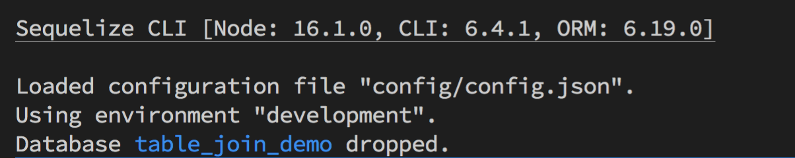
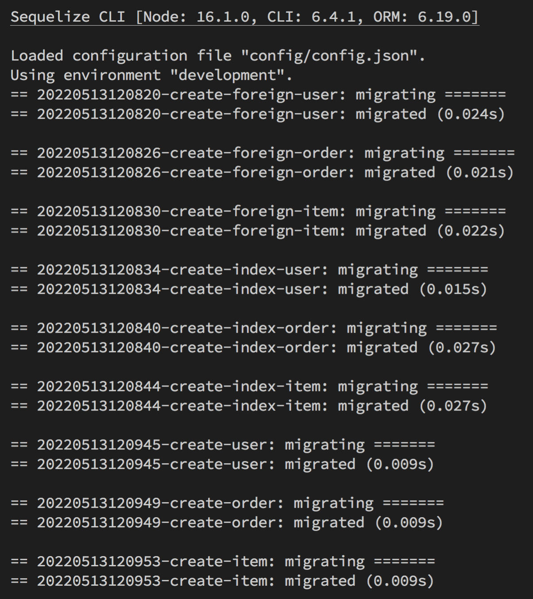
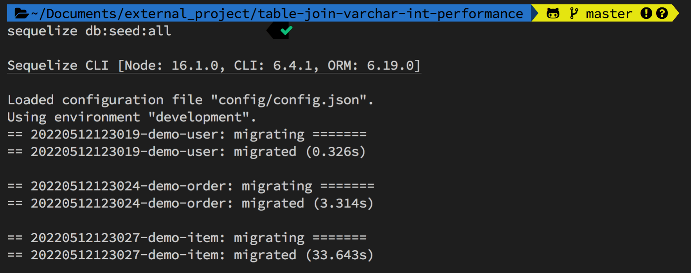
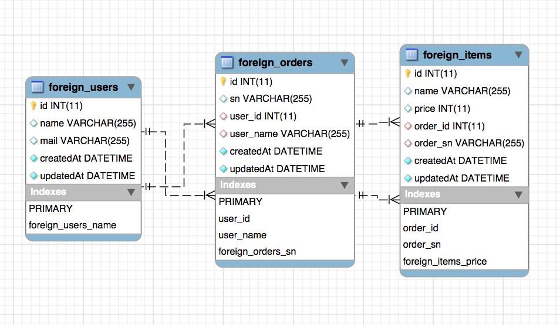
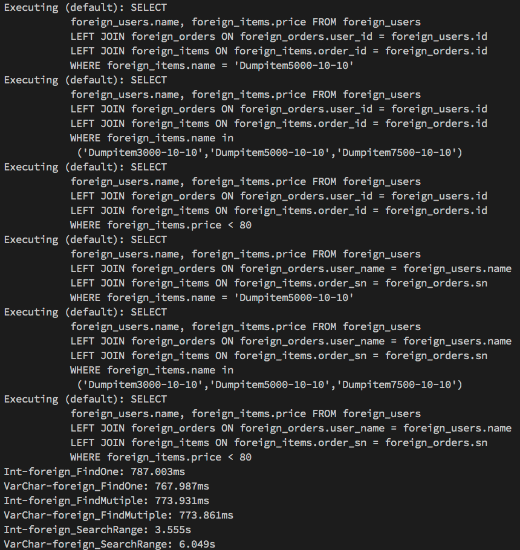
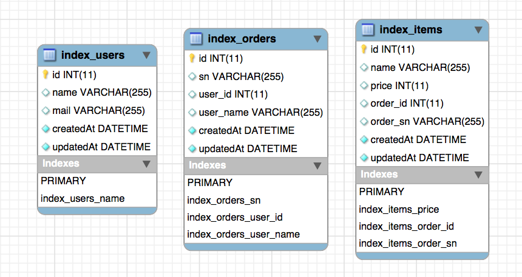
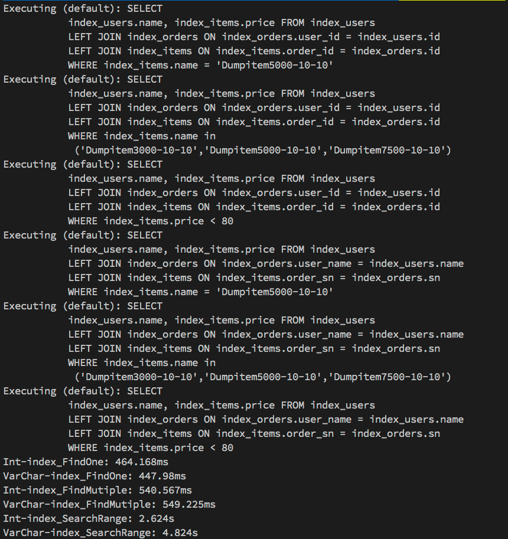
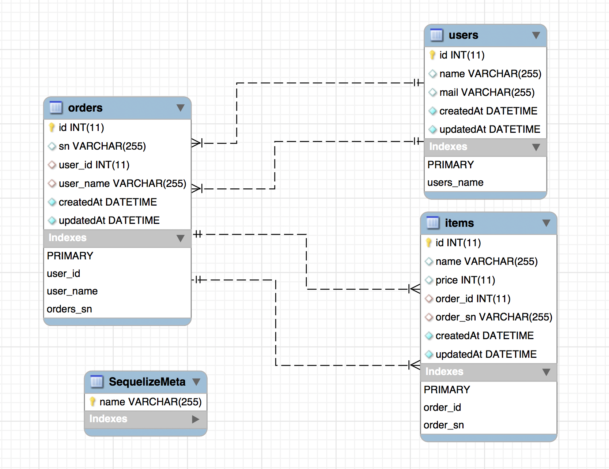
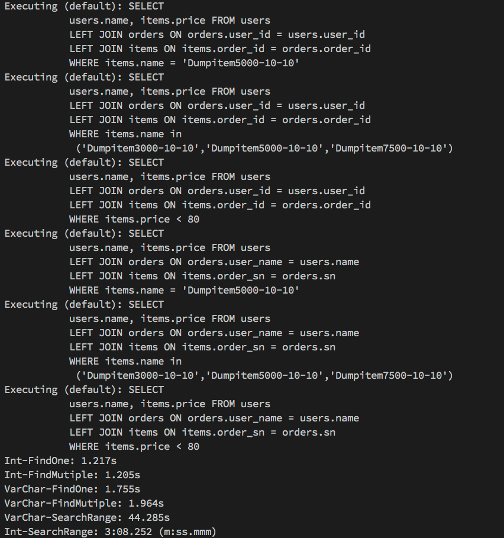

# 實驗 Table Join 時，選擇文字欄位（VARCHAR）與數值欄位（INTEGER）在效能（performance）上的差異。

因為剛好朋友在專案的搜尋上遇到效能瓶頸，在看過程式碼後，發現他在 Table 做 Join 時都是挑選文字欄位，因此研判這應該就是導致效率低下的主要原因；為了實驗文字欄位（VARCHAR）與數值欄位（INTEGER）在 Join 時的效能差異，特別撰寫了這篇文章，但實驗有點結果打破了我過往的認知...

### 大綱

- 一、模擬情境說明
- 二、在 DB 建立測試測試對照組 Table
- 三、設計＆建立模擬資料
- 四、設計測試程式
- 五、模擬每個情境，取得測試結果
- 六、令人意外的總結

# 一、模擬情境說明

假設一個商城系統：

- 有 1W 個顧客
- 每位顧客有 10 筆訂單（10W 筆訂單）
- 每筆訂單有 10 筆購買的商品（100W 筆購買的商品）

如果今天想要搜尋某個價格區間的「商品」，有哪些「使用者」購買；使用文字欄位（ex：VARCHAR）與數值欄位（ex：INTEGER），在效能上實際會有多少差異。

---

# 二、在 DB 建立測試測試對照組 Table

如果想知道詳細的程式，或是打算在 Local 端模擬一樣的環境，大家可以參考我在[GitHub 上面的專案](https://github.com/dean9703111/table-join-varchar-int-performance)

這裡我們分成 3 種情境來做測試：

**情境 A**： 將 Join 的欄位設計 Foreign Key，搜尋用到的欄位也設計 Index
**情境 B**： 將 Foreign Key 的設計拿掉，改為使用 Index
**情境 C**： 把 Index 全部拿到，來看看到底有多慘

DB 我選擇的是 MySQL，而 Table 的設計如下：

- users（顧客）
  | Column | Type | Des |
  |----------|---------|---------|
  | id | INTEGER | 自動成長的 id |
  | name | STRING | 姓名 |
  | mail | STRING | mail |

- orders（訂單）
  | Column | Type | Des |
  |----------|---------|---------|
  | id | INTEGER | 自動成長的 id |
  | sn | STRING | 給人看的訂單序號 |
  | user_id | INTEGER | 對應顧客(user) 的 id |
  | user_name | STRING | 對應顧客(user) 的 name |
  | order_id | INTEGER | 內容與 id 相同，用來測試沒 Index 時的效能 |

  設計「user_id、user_name」是為了對比文字欄位（ex：VARCHAR）與數值欄位（ex：INTEGER）的差異。

- items（購買的商品）
  | Column | Type | Des |
  |----------|---------|---------|
  | id | INTEGER | 自動成長的 id |
  | name | STRING | 商品名稱 |
  | price | INTEGER | 商品價格 |
  | order_id | INTEGER | 對應訂單(order) 的 id |
  | order_sn | STRING | 對應訂單(order) 的 sn |

  設計「order_id、order_sn」是為了對比文字欄位（ex：VARCHAR）與數值欄位（ex：INTEGER）的差異。

可用如下指令建立資料：

- Clone 專案：`git clone git@github.com:dean9703111/table-join-varchar-int-performance.git`
- 安裝套件：`npm install`
- 安裝 sequelize cli：`npm install -g sequelize-cli`
- 將 config 資料夾底下的 config.exmaple.json 複製為 config.json，並填入自己的 DB 資訊
- 建立 DB：`sequelize db:create`
- 執行 migration 建立 Tables：`sequelize db:migrate`

> 資料都是使用 Node.js 搭配 sequelize 這款套件來建立的，如果想了解詳細使用方式，可以參考我先前的的[文章](https://medium.com/dean-lin/%E5%88%9D%E6%8E%A2-sequelize-%E5%9C%A8-node-js-%E5%BF%AB%E9%80%9F%E5%BB%BA%E7%AB%8B-migration-seeder-mysql-b8a16d2ff73e)




> 在沒設計 Index 的 Table（users/orders） 對照組中，會新增 user_id/order_id 的欄位，此欄位內容與 id 欄位相同，單純用來測試效能用的。

---

# 三、設計＆建立模擬資料

我們需要設計 3 個 Seeder，將期望的資料塞入

**STEP 1**：建立 1W 個顧客
**STEP 2**：為每位顧客建立 10 筆訂單（user_id、user_name 需與 user Table 關聯）
**STEP 3**：為每筆訂單建立 10 筆購買的商品（order_id、order_sn 需與 order Table 關聯）

執行全部 Seeder

```
sequelize db:seed:all
```



> 因為沒建立 Index 的 Table 搜尋效能比想像的更加悲劇，所以在這個情境下將 User 的數量減為 1/10，也就是說購買商品(item)的數量只有 10W 筆。

---

# 四、設計測試程式

我們需要設計一個可以根據上面 3 種情境測試的程式，同時用 3 種常見的查詢來比較各自的效能：

1. 單筆查詢：`findOne`
2. 多筆查詢：`findMutiple`
3. 設定條件的批量查詢 ：`searchRange`

程式放在下面，有興趣再看就好，這不是本文的重點，我知道還有很多細節可以優化 😇

```js
const { sequelize } = require("./models");
const { QueryTypes } = sequelize;
function getJoinCol (colType, setting) {
    let orderJoinCol = "";
    let itemJoinCol = ""
    if (setting === "" && colType === "Int") {
        orderJoinCol = `orders.user_id = users.user_id`
        itemJoinCol = `items.order_id = orders.order_id`
    } else if (colType === "Int") {
        orderJoinCol = `${setting}orders.user_id = ${setting}users.id`
        itemJoinCol = `${setting}items.order_id = ${setting}orders.id`
    } else if (colType === "VarChar") {
        orderJoinCol = `${setting}orders.user_name = ${setting}users.name`
        itemJoinCol = `${setting}items.order_sn = ${setting}orders.sn`
    }
    return { "orderJoinCol": orderJoinCol, "itemJoinCol": itemJoinCol }
}
async function findOne (colType, setting) {
    console.time(`${colType}-${setting}FindOne`);
    let {orderJoinCol,itemJoinCol} = getJoinCol (colType, setting)
    const results = await sequelize.query(`SELECT 
           ${setting}users.name, ${setting}items.price FROM ${setting}users
           LEFT JOIN ${setting}orders ON ${orderJoinCol}
           LEFT JOIN ${setting}items ON ${itemJoinCol}
           WHERE ${setting}items.name = 'Dumpitem5000-10-10'`, { type: QueryTypes.SELECT });
    console.timeEnd(`${colType}-${setting}FindOne`);
}
async function findMutiple (colType, setting) {
    console.time(`${colType}-${setting}FindMutiple`);
    let {orderJoinCol,itemJoinCol} = getJoinCol (colType, setting)
    const results = await sequelize.query(`SELECT 
           ${setting}users.name, ${setting}items.price FROM ${setting}users
           LEFT JOIN ${setting}orders ON ${orderJoinCol}
           LEFT JOIN ${setting}items ON ${itemJoinCol}
           WHERE ${setting}items.name in 
            ('Dumpitem3000-10-10','Dumpitem5000-10-10','Dumpitem7500-10-10')`
        , { type: QueryTypes.SELECT });
    console.timeEnd(`${colType}-${setting}FindMutiple`);
}
async function searchRange (colType, setting) {
    console.time(`${colType}-${setting}SearchRange`);
    let {orderJoinCol,itemJoinCol} = getJoinCol (colType, setting)
    const results = await sequelize.query(`SELECT 
           ${setting}users.name, ${setting}items.price FROM ${setting}users
           LEFT JOIN ${setting}orders ON ${orderJoinCol}
           LEFT JOIN ${setting}items ON ${itemJoinCol}
           WHERE ${setting}items.price < 80`, { type: QueryTypes.SELECT });
    console.timeEnd(`${colType}-${setting}SearchRange`);
}

function test (type) {
    switch (type) {
        case 'foreign':
            findOne("Int", "foreign_");
            findMutiple("Int", "foreign_");
            searchRange("Int", "foreign_");
            findOne("VarChar", "foreign_");
            findMutiple("VarChar", "foreign_");
            searchRange("VarChar", "foreign_");
            break;
        case 'index':
            findOne("Int", "index_");
            findMutiple("Int", "index_");
            searchRange("Int", "index_");
            findOne("VarChar", "index_");
            findMutiple("VarChar", "index_");
            searchRange("VarChar", "index_");
            break;
        default:
            findOne("Int", "");
            findMutiple("Int", "");
            searchRange("Int", "");
            findOne("VarChar", "");
            findMutiple("VarChar", "");
            searchRange("VarChar", "");
    }
}

// test("foreign")//有建立 foreign Key 的
// test("index")//有建立 index 的
test()//什麼都沒有設定的
```

---

# 五、模擬每個情境，取得測試結果

**➤ 情境 A**： 將 Join 的欄位設計 Foreign Key，搜尋用到的欄位也設計 Index

ER Diagram


執行程式


測試數據：

- INTEGER 單筆查詢：787.003ms
- INTEGER 多筆查詢：773.931ms
- INTEGER 設定條件的批量查詢：3.555s
- VARCHAR 單筆查詢：767.987ms
- VARCHAR 多筆查詢：773.861ms
- VARCHAR 設定條件的批量查詢：6.049s

**➤ 情境 B**： 將 Foreign Key 的設計拿掉，改為使用 Index

ER Diagram


執行程式


測試數據：

- INTEGER 單筆查詢：464.168ms
- INTEGER 多筆查詢：540.567ms
- INTEGER 設定條件的批量查詢：2.624s
- VARCHAR 單筆查詢：447.98ms
- VARCHAR 多筆查詢：549.225ms
- VARCHAR 設定條件的批量查詢：4.824s

**➤ 情境 C**： 把 Index 全部拿到，來看看到底有多慘

ER Diagram


執行程式


測試數據：

- INTEGER 單筆查詢：1.217s
- INTEGER 多筆查詢：1.205s
- INTEGER 設定條件的批量查詢：3:08.252 (m:ss.mmm)
- VARCHAR 單筆查詢：1.755s
- VARCHAR 多筆查詢：1.964s
- VARCHAR 設定條件的批量查詢：44.285s

---

# 六、令人意外的總結

這邊先列出比較表，方便大家理解：

|  | 用 Foreign Key | 用 Index | 什麼都沒用 |
|----------|---------|---------|---------|
| INTEGER 單筆查詢 | 0.78s | 0.46s | 1.2s |
| INTEGER 多筆查詢 | 0.77s | 0.54s | 1.2s |
| INTEGER 設定條件的批量查詢 | 3.5s | 2.6s | 188s |
| VARCHAR 單筆查詢 | 0.76s | 0.44s | 1.7s |
| VARCHAR 多筆查詢 | 0.77s | 0.55s | 1.9s |
| VARCHAR 設定條件的批量查詢 | 6s | 4.8s | 44.2s |

在這張表裡面有我預料的結果，也有我沒想到的結果，我歸類如下：
- 批量查詢時，如果有設定 Foreign Key、Index，INTEGER 的搜尋效率優於 VARCHAR。
- 在有設定 Foreign Key、Index，那單筆、多筆查詢的效率是差不多的，跟使用 INTEGER 還是 VARCHAR 關聯性不大。
- Foreign Key 的搜尋效率略低於 Index（可能是我在資料表上設計的不足）。
- 如果沒建立 Index，那搜尋效率慘不忍睹。
- 如果沒建立 Index，在批量查詢時，INTEGER 查詢效率低於 VARCHAR（這部分我真的搞不懂為什麼）。

老實說，這個實驗結果反而把我弄得有點迷糊，也許還要從更多面向做測試，追尋知識的道路真的任重道遠🤕

> 本篇是從「搜尋花費時間」的角度來實驗，歡迎高手從硬體消耗資源的角度來實驗。

### 關聯專案

1. [sequelize-mysql-migration-seeder](https://github.com/dean9703111/sequelize-mysql-migration-seeder)
