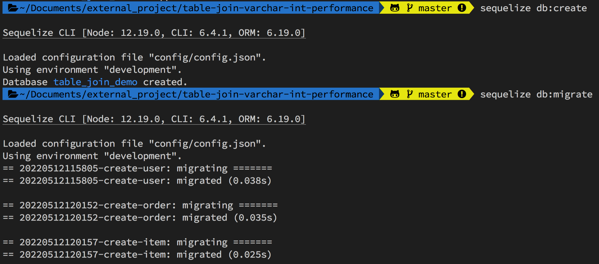
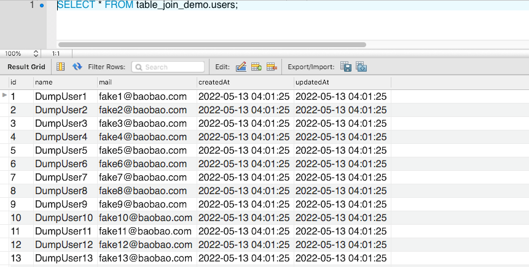
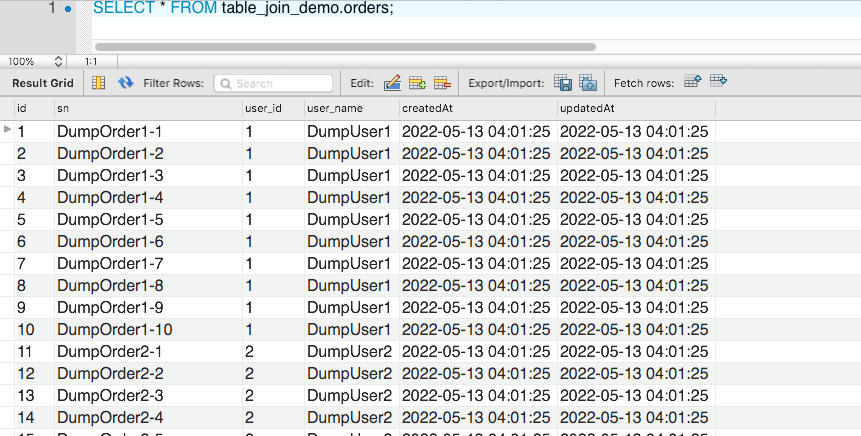
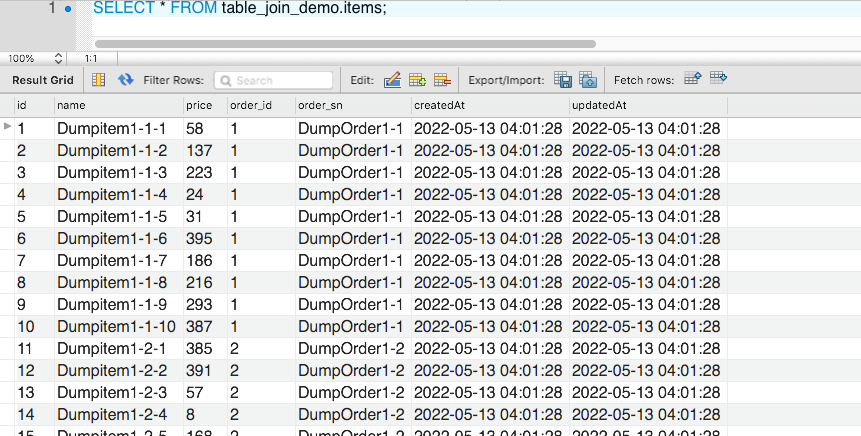
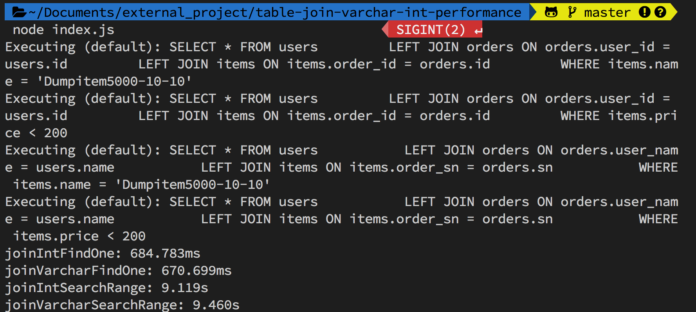
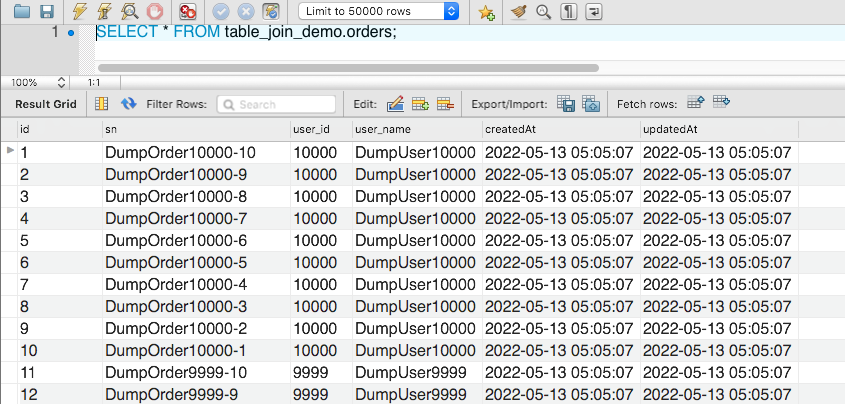
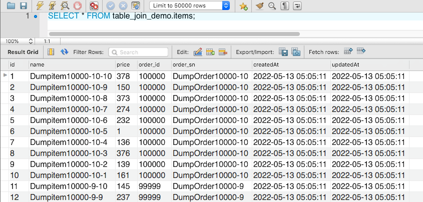
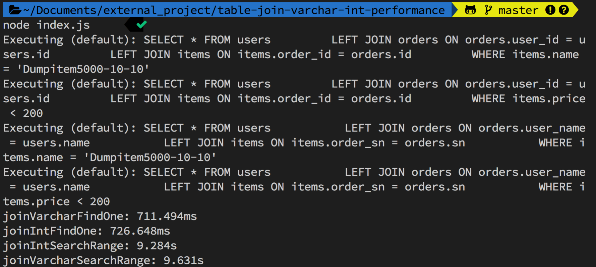

# 實驗 Table Join 時，選擇文字欄位（VARCHAR）與數值欄位（INT）在效能（performance）上的差異。

因為剛好朋友在專案的搜尋上遇到效能瓶頸，在看過程式碼後，發現他在 Table 做 Join 時都是挑選文字欄位，因此研判這應該就是導致效率低下的主要原因；為了實驗文字欄位（VARCHAR）與數值欄位（INT）在 Join 時的效能差異，特別撰寫了這篇文章，但實驗的結果完全不在我的意料之內...

### 大綱

- 一、情境說明
- 二、建立測試 DB、Table
- 三、設計＆建立模擬資料
- 四、實驗文字欄位（VARCHAR）與數值欄位（INT）在 Join 時的差異
- 五、令人意外的總結

# 一、模擬情境說明

假設一個商城系統：

- 有 1W 個顧客
- 每位顧客有 10 筆訂單（10W 筆訂單）
- 每筆訂單有 10 筆購買的商品（100W 筆購買的商品）

如果今天想要搜尋某個價格區間的「商品」，有哪些「使用者」購買；使用文字欄位（ex：VARCHAR、CHAR）與數值欄位（ex：INT），在效能上實際會有多少差異。

---

# 二、建立測試 DB、Table

如果想知道詳細的程式，或是打算在 Local 端模擬一樣的環境，大家可以參考我在[GitHub 上面的專案](https://github.com/dean9703111/table-join-varchar-int-performance)

DB 我選擇的是 MySQL，而 Table 的設計如下：

- users（顧客）
  | Column | Type | Des |
  |----------|---------|---------|
  | id | INTEGER | 自動成長的 id |
  | name | STRING | 姓名 |
  | mail | STRING | mail |

- orders（訂單）
  | Column | Type | Des |
  |----------|---------|---------|
  | id | INTEGER | 自動成長的 id |
  | sn | STRING | 給人看的訂單序號 |
  | user_id | INTEGER | 對應顧客(user) 的 id |
  | user_name | STRING | 對應顧客(user) 的 name |

  設計「user_id、user_name」是為了對比文字欄位（ex：VARCHAR）與數值欄位（ex：INT）的差異。

- items（購買的商品）
  | Column | Type | Des |
  |----------|---------|---------|
  | id | INTEGER | 自動成長的 id |
  | name | STRING | 商品名稱 |
  | price | INTEGER | 商品價格 |
  | order_id | INTEGER | 對應訂單(order) 的 id |
  | order_sn | STRING | 對應訂單(order) 的 sn |

  設計「order_id、order_sn」是為了對比文字欄位（ex：VARCHAR）與數值欄位（ex：INT）的差異。

可用如下指令建立資料：

- Clone 專案：`git clone git@github.com:dean9703111/table-join-varchar-int-performance.git`
- 安裝套件：`npm install`
- 安裝 sequelize cli：`npm install -g sequelize-cli`
- 將 config 資料夾底下的 config.exmaple.json 複製為 config.json，並填入自己的 DB 資訊
- 建立 DB：`sequelize db:create`
- 執行 migration 建立 Tables：`sequelize db:migrate`

> 資料都是使用 Node.js 搭配 sequelize 這款套件來建立的，如果想了解詳細使用方式，可以參考我先前的的[文章]()



下圖是用 MySQLWorkbench 產生的 ER Diagram


---

# 三、設計＆建立模擬資料

我們需要設計 3 個 Seeder，將期望的資料塞入

**STEP 1**：建立 1W 個顧客
**STEP 2**：為每位顧客建立 10 筆訂單（user_id、user_name 需與 user Table 關聯）
**STEP 3**：為每筆訂單建立 100 筆購買的商品（order_id、order_sn 需與 order Table 關聯）

執行全部 Seeder
```
sequelize db:seed:all
```


**STEP 4**：前往 DB ，確認資料是否有正確寫入
- users Table
  
- orders Table
  
- items Table
  

---

# 四、比對文字欄位（VARCHAR）與數值欄位（INT）在 Join 時的差異

**STEP 1**：撰寫測試程式

在資料建立完後，我們透過下面幾種情境來看看實際上的效能差異：

1. 用數值欄位（INT）Join，搜尋單筆資訊：`joinIntFindOne()`
2. 用數值欄位（INT）Join，設定條件搜尋大量資訊：`joinIntSearchRange()`
3. 用文字欄位（VARCHAR）Join，搜尋單筆資訊：`joinVarcharFindOne()`
4. 用文字欄位（VARCHAR）Join，設定條件搜尋大量資訊：`joinVarcharSearchRange()`

**STEP 2**：測試並取得結果

結果執行的結果完全不在我想像範圍之內，在下圖中大家可以看到，無論是用文字欄位（VARCHAR）還是數值欄位（INT）來做Join，搜尋出來的速度居然相差無幾，這個結果有點顛覆我過去的認知。



**STEP 3**：建立反向的資料來做測試

你以為我就會臣服於這個實現結果嗎？不！我要再做一個測試！

改變如下參數：
1. 在建立訂單（order）的 Seeder 時，故意將 user_id、name 反向排序
1. 在建立訂單（item）的 Seeder 時，故意將 order_id、sn 反向排序

> 上述可透過調整 .env 的 CREATE_TABLE_SORT 來設定要正向（postive）還是反向（reverse）

透過如下指令將 DB、Table 重建，並重新執行 Migration、Seeder
```
sequelize db:migrate:undo:all
sequelize db:migrate
sequelize db:seed:all
```

調整後的 orders、items 的 Table 內容



**STEP 4**：測試反向的資料對搜尋效能的影響

執行程式後的結果讓我非常意外😱😱😱，居然兩者實際花費的時間是差不多的😫


# 五、令人意外的總結

老實說，我完全沒想到實驗的結果；因為在我過往的認知中，兩者的所需花費的時間差異應該會相當大。

當然也有可能是因為我的實驗情境不夠完善、查詢數量不夠所導致

> 筆者有嘗試將 item 數量增加到 1000W 筆，但實驗的結果還是差不多💀

當然實務上還是建議用數值欄位（INT）來做 Join，從演算法的邏輯來講會更省空間，文字欄位（VARCHAR）主要的作用還是給使用者觀看的。

如果對實驗有其他的建議，也歡迎大家留言，筆者相信討論能增進彼此的成長。

> 本篇是從「搜尋花費時間」的角度來實驗，歡迎高手從硬體消耗資源的角度來實驗。

### 關聯專案

1. [sequelize-mysql-migration-seeder](https://github.com/dean9703111/sequelize-mysql-migration-seeder)
