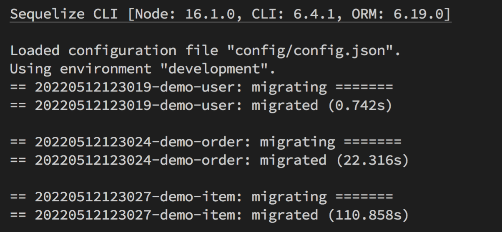

# table-join-varchar-int-performance

了解 Table Join 時，選擇文字欄位（VARCHAR）與數值欄位（INT）在效能（performance）上的差異。

### 情境模擬:

假設一個商城的系統，有 1W 個顧客，10W 筆訂單，100W 筆商品明細；使用文字欄位（ex：VARCHAR、CHAR）與數值欄位（ex：INT），在效能上實際會有多少差異。

# 初探 sequelize，快速了解 Migration、Seeder 如何使用（Node.js、MySQL）

### 初始化專案

```
mkdir sequelize-demo && cd  sequelize-demo
npm init
```

### sequelize

```
npm install -g sequelize-cli
npm install --save sequelize
```

### mysql

```
npm install --save mysql2
```

# 實驗步驟

### STEP 1：建立測試用資料庫

```
mysql -u root -p -e "create database sequelize_demo"
```

### STEP 2：使用 sequelize 建立所需的 table

初始化相關設定擋

```
sequelize init
```

記得調整成自己的 DB 登入參數

```json
"development": {
    "username": "root",
    "password": "kingofdragon",
    "database": "sequelize_demo",
    "host": "127.0.0.1",
    "dialect": "mysql"
  },
```

新增所需 Tables & 基礎欄位

```
sequelize model:generate --name user --attributes name:string,mail:string
sequelize model:generate --name order --attributes user_id:integer,total_price:integer
sequelize model:generate --name item --attributes order_id:integer,price:integer
```


前往 migrations 的資料夾，增加 Table 間的關聯性 & 設計 Index

調整 order Table，建立 order user_id 與 user 的關聯性

```js
user_id: {
    type: Sequelize.INTEGER,
    references: {
        model: 'users',
        key: 'id'
    },
},
```

調整 item Table，建立 item order_id 與 item 的關聯性

```js
oder_id: {
    type: Sequelize.INTEGER,
    references: {
        model: 'orders',
        key: 'id'
    },
},
```

前往 models 的資料夾，調整 associate，讓各自的關係建立

像是在 models/user.js，一個 user 會有多個 order

```js
static associate(models) {
    // define association here
    this.hasMany(models.order, {
        foreignKey: 'order_id'
    });
}
```

models/order.js，一個 order 會隸屬於某個 user，並擁有多個 item

```js
static associate(models) {
    // define association here
    this.belongsTo(models.user);
    this.hasMany(models.item, {
        foreignKey: 'item_id'
    });
}
```

models/item.js，一個 item 會隸屬於某個 order

```js
static associate(models) {
    // define association here
    this.belongsTo(models.order);
}
```

修改完成之後，就可以下指令建立剛剛設定的 Table 啦～

```
sequelize db:migrate
```


下圖是用 MySQLWorkbench 產生的 ER Diagram


> 如果想要回朔 migration 可用如下指令：
> 退一個版本：`sequelize db:migrate:undo`
> 退到初始狀態：`sequelize db:migrate:undo:all`
> 退到指定版本：`sequelize db:migrate:undo:all --to XXXXXXXXXXXXXX-create-user.js `

### 建立 Seeder，將初始資料塞入 Table

目標：是建立 100 個使用者（user），每個使用者有 10 筆訂單（order），每筆訂單下面有 10 個貨物（item）。

先建立 Seeder 檔案

```
sequelize seed:generate --name demo-user
sequelize seed:generate --name demo-order
sequelize seed:generate --name demo-item
```


建立各自 Seeder 的邏輯，以前 order 舉例：

```js
"use strict";

module.exports = {
  async up(queryInterface, Sequelize) {
    function getRandomInt(max) {
      return Math.floor(Math.random() * max);
    }
    // 每個使用者有 10 筆訂單（order）
    var orderArray = [];

    for (let i = 1; i <= 100; i++) {
      for (let j = 1; j <= 10; j++) {
        const order = {
          user_id: i,
          total_price: Math.floor(Math.random() * 1000),
          createdAt: new Date(),
          updatedAt: new Date(),
        };
        orderArray.push(order);
      }
    }

    return queryInterface.bulkInsert("Orders", orderArray);
  },

  async down(queryInterface, Sequelize) {
    return queryInterface.bulkDelete("Orders", null, {});
  },
};
```

執行 Seeder

執行單個 Seeder：`sequelize db:seed --seed my_seeder_file.js`
執行全部 Seeder：`sequelize db:seed:all`



前往 DB 確認是否有正確寫入：

1. 建立 100 個使用者（user）。
   
2. 建立 100 個使用者（user），每個使用者有 10 筆訂單（order），共 1000 筆資料。
   
3. 建立 100 個使用者（user），每個使用者有 10 筆訂單（order），每筆訂單下面有 10 個貨物（item），共 10000 筆資料。
   

取消執行的 Seeder

取消最近的 Seeder：`sequelize db:seed:undo`
取消指定的 Seeder：`sequelize db:seed:undo --seed my_seeder_file.js`
取消全部 Seeder：`sequelize db:seed:undo:all`

### 參考資料

1. [透過 sequelize 來達成 DB Schema Migration](https://hackmd.io/@TSMI_E7ORNeP8YBbWm-lFA/ryCtaVW_M?print-pdf)
